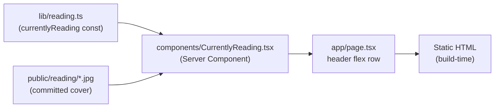

# 0002 — Currently Reading Section

**Date:** 2026-08-20
**Status:** Accepted
**Author:** Architect Agent
**Related ADRs:** _pending — created on acceptance_

## Problem Statement

The home page (`app/page.tsx`) leads with only the "Blog" heading and an intro line, then
the post list. There is no personal signal on the landing page. Adding a lightweight
"Currently Reading" element beside the Blog header gives returning visitors a reason to
revisit and adds a human touch, without introducing a runtime data source or violating the
static-export, build-time-only data convention.

## Proposed Solution

Introduce a small typed data module and a presentational component, then compose them into
the existing home page header row.

**New files**
- `lib/reading.ts` — exports a `CurrentlyReading` type and a single `currentlyReading`
  constant (title, author, synopsis, coverImage, coverAlt). Build-time data only,
  consistent with `lib/posts.ts`. No filesystem read needed — it is a plain typed object.
- `components/CurrentlyReading.tsx` — Server Component (no interactivity) rendering a card:
  cover image (`next/image`, `unoptimized`-safe via the global config), title, author,
  synopsis.
- `public/reading/leadership-is-language.jpg` — committed cover image.

**Modified files**
- `app/page.tsx` — the current `
` header block becomes a
  responsive flex row: the existing heading/intro on the left, `<CurrentlyReading />` on the
  right. On mobile it stacks (heading then card); on `md:` and up they sit side by side with
  the card constrained to a fixed max width so it does not dominate.

Data flow: `lib/reading.ts` (static object) → `CurrentlyReading` component → rendered in
`app/page.tsx` at build time. No client JS, no fetch, no runtime dependency.

The section is a discrete, self-contained unit with a cover image → it is rendered as a
card per `docs/STYLE_GUIDE.md` ("If you'd render it as an item in a `.map()` ... it's a
card" / interactive-or-contained aside). It uses `rounded-xl border border-border
bg-surface p-4 shadow-sm`.

## Alternatives Considered

### Alternative A — Markdown file + gray-matter in a new `reading/` content dir
Mirrors the `posts/` pattern. Ruled out: adds parsing machinery for a single short record.
YAGNI — a typed constant in `lib/` is simpler, type-checked, and matches the build-time
convention without a new content pipeline.

### Alternative B — Fetch live data from Goodreads / an external API
Ruled out hard: violates the static-export "no runtime fetch, no external integration"
rules. Goodreads' API is also effectively deprecated for new keys. Cover image is committed
to `public/` instead.

## Impact Assessment

| Area | Impact | Notes |
|---|---|---|
| Database | None | No DB in project |
| API contract | None | No API |
| Frontend | New component + home page header change | `CurrentlyReading.tsx`, `app/page.tsx` |
| Tests | None | Project is intentionally test-free (static blog) |
| External API | No new calls | Cover committed to `public/` |
| Infrastructure | None | Static asset only |
| Observability | None | No server runtime |
| Security / Compliance | None | Public data, no user input, no `dangerouslySetInnerHTML` |

## Open Questions

None.

## Acceptance Criteria

- `lib/reading.ts` exports a `CurrentlyReading` type and a `currentlyReading` constant with
  fields: `title`, `author`, `synopsis`, `coverImage`, `coverAlt` — all typed, no `any`.
- `components/CurrentlyReading.tsx` is a Server Component (no `'use client'`) that renders
  the title, author, synopsis, and cover image from the passed/imported data.
- On `app/page.tsx`, the "Currently Reading" card renders to the right of the "Blog" heading
  on viewports `md` and wider, and stacks below the heading on narrow viewports.
- The card displays *Leadership is Language* by L. David Marquet with a short synopsis and a
  committed cover image at `public/reading/leadership-is-language.jpg`.
- The cover `<Image>`/`` has non-empty descriptive alt text.
- `npm run build` completes successfully (static export, `images.unoptimized: true`
  respected) with no TypeScript errors.
