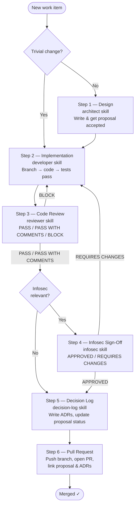

## OpenCode Skills

Getting hands-on with AI-driven development means figuring out what actually works — and that looks different for every person, team, and codebase. There's no universal playbook here.

Over the past few months I've built [Squirrel Notes](https://squirrelnotes.app/), [Fragile](https://github.com/garethrhughes/fragile), this blog, and replaced my [Adobe portfolio](https://gareth.photography/) — all while evolving my approach to working with AI tools. I progressed from Claude Code to GitHub Copilot, then landed on OpenCode (while still using Copilot for some workflows).

The workflow I developed while building Fragile clicked for me, so I extracted it into a reusable set of skills you can find [here](https://github.com/garethrhughes/skills).

## The Skills

| Name | Description |
|---|---|
| [architect](https://github.com/garethrhughes/skills/blob/main/architect/SKILL.md) | Drives technical design decisions, writes proposals before significant changes, and maintains the proposal index |
| [developer](https://github.com/garethrhughes/skills/blob/main/developer/SKILL.md) | Writes production-quality TypeScript following TDD (red-green-refactor) and project conventions |
| [reviewer](https://github.com/garethrhughes/skills/blob/main/reviewer/SKILL.md) | Reviews staged changes for security, correctness, performance, IaC safety, observability, and convention adherence; returns a PASS / PASS WITH COMMENTS / BLOCK verdict with Acceptance Criteria traceability |
| [infosec](https://github.com/garethrhughes/skills/blob/main/infosec/SKILL.md) | Read-only security and compliance audit (ISO27001-aligned by default). Audits encryption, access control, audit logging, secrets, IAM, network exposure, and supply chain. Returns APPROVED / REQUIRES CHANGES / APPROVED WITH EXCEPTION |
| [decision-log](https://github.com/garethrhughes/skills/blob/main/decision-log/SKILL.md) | Captures and maintains architectural decisions (ADRs) in `docs/decisions/` with a running index |
| [dev-workflow](https://github.com/garethrhughes/skills/blob/main/dev-workflow/SKILL.md) | Full feature development cycle: proposal → implementation → review → infosec sign-off → decision logging → PR |
| [project-bootstrap](https://github.com/garethrhughes/skills/blob/main/project-bootstrap/SKILL.md) | Interactive bootstrap that asks a structured set of questions (app stack, IaC, observability, security/compliance, domain) and produces a complete CLAUDE.md and Project Context block |
| [project-onboard](https://github.com/garethrhughes/skills/blob/main/project-onboard/SKILL.md) | Interactive onboarding for an existing codebase — investigates the repo to fill in CLAUDE.md and the Project Context block, asking the user only what the code can't answer |

## How It Fits Together

The core workflow I use on Fragile follows this chain: **Architect → Developer → Reviewer → Decision Log**. I've since added an infosec skill to close the loop on security sign-off before anything reaches a PR.

The `project-bootstrap` and `project-onboard` skills handle the setup side — configuring the right context for new projects or bringing existing codebases into the workflow. I initially built this blog and my photography site with minimal process, which made them a useful proving ground for the onboarding skill.

For personal projects at least, this approach with OpenCode is working well.

## The Dev Workflow

The `dev-workflow` skill orchestrates the full feature development cycle — from proposal to merged PR — by sequencing the other skills in the right order and defining exactly when to loop back.

