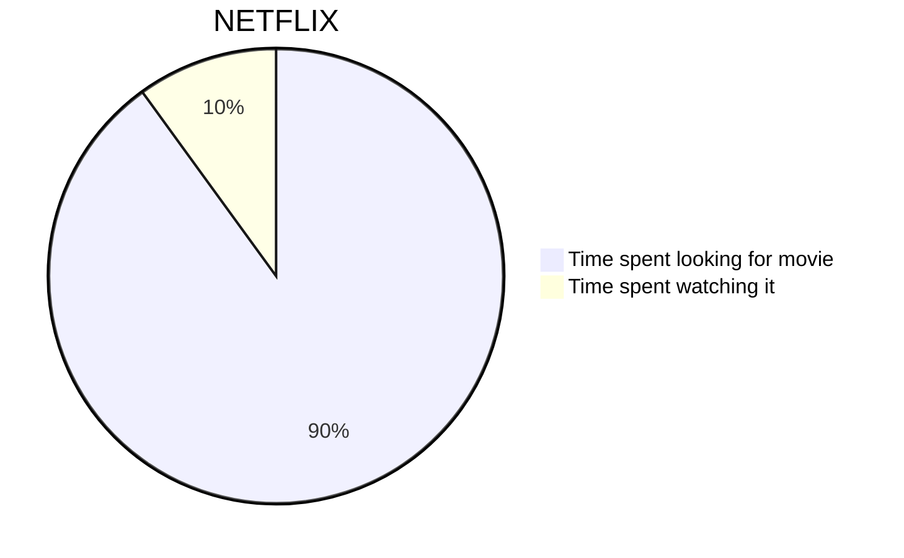
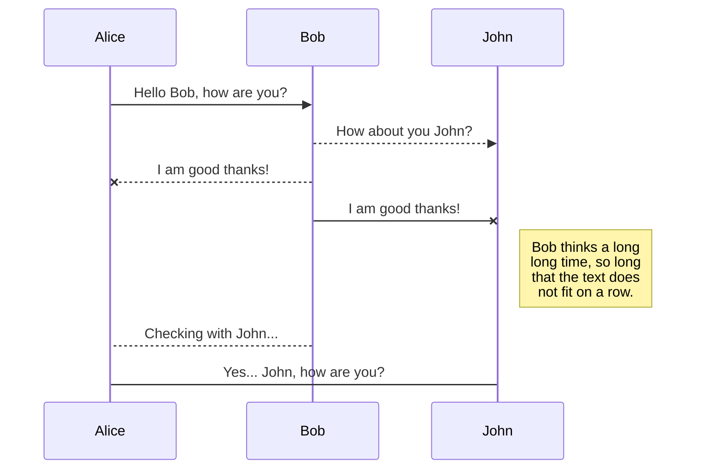
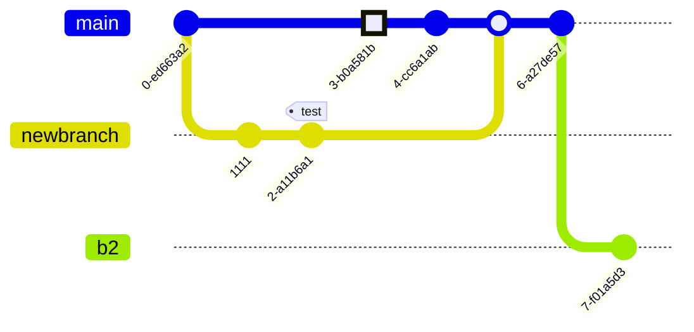

This site supports [Mermaid](https://mermaid.js.org) diagrams in blog posts. Diagrams are written as fenced code blocks with the `mermaid` language tag and rendered to SVG at build time — no JavaScript is shipped to the browser.

## How it works

When the site is built, `lib/mermaid.ts` scans the raw markdown for ` ```mermaid ` blocks. Each block is written to a temporary file and passed to [`@mermaid-js/mermaid-cli`](https://github.com/mermaid-js/mermaid-cli) (`mmdc`), which uses a headless Chromium instance to produce an SVG. The fenced block is then replaced with a `<div class="mermaid-diagram">` containing the inline SVG. The rest of the markdown pipeline (`react-markdown` + `rehype-raw`) renders the SVG as-is.

The end result is a fully static page — diagrams are plain SVG embedded in the HTML, visible without any client-side rendering.

```mermaid
flowchart LR
  MD["```mermaid``` block"] --> mmdc
  mmdc --> SVG["Inline SVG"]
  SVG --> HTML["Static HTML page"]
```

If a diagram fails to render the original fenced block is preserved, so a syntax error won't break the rest of the post.

## Examples







